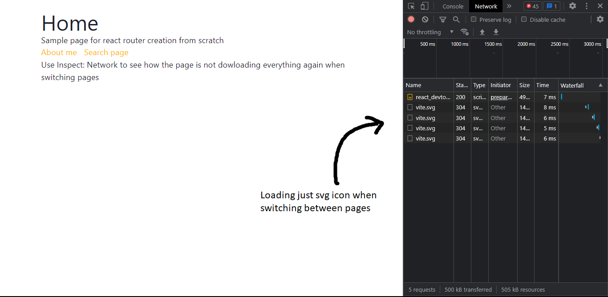

# React Router Clone
- [x] Single Page Applications
- [x] Navegation between pages with back button
- [x] Link component 
- [x] Router component
- [x] Supports default route (404)
- [x] Supports routes with params
- [x] <Route /> component
- [x] Lazy Loading for routes

